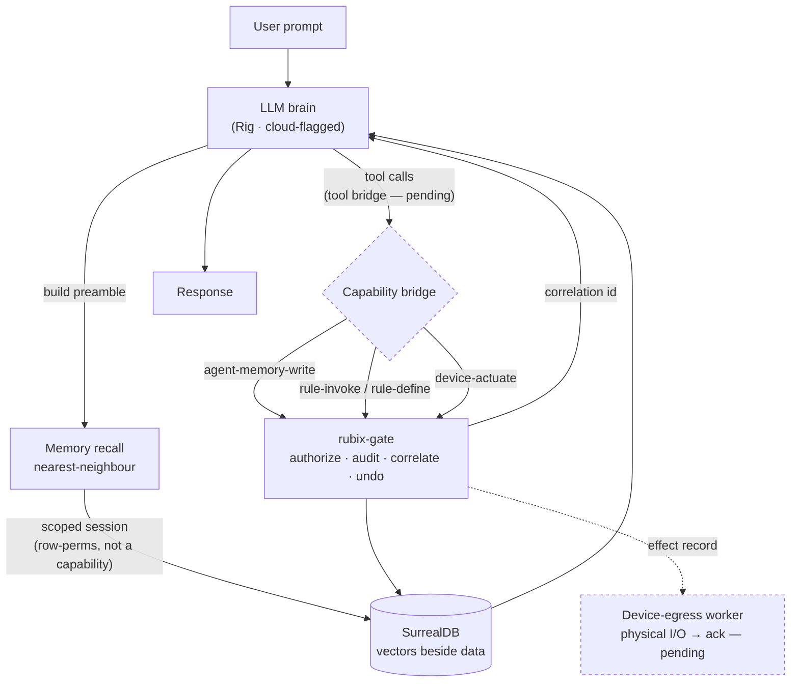
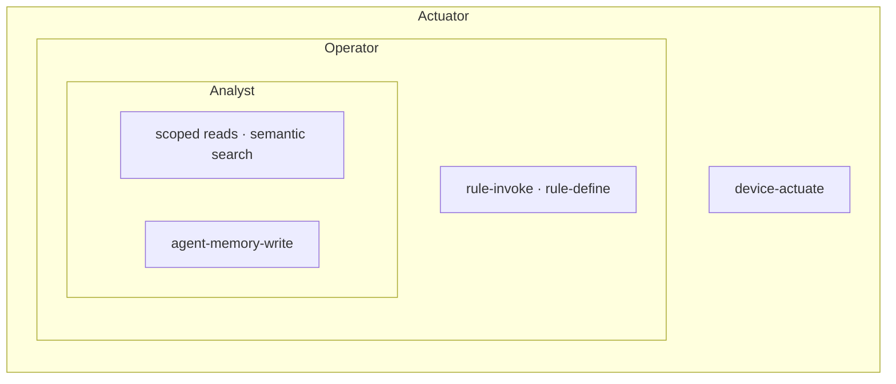

# Agent Runtime

An AI agent is bolted onto Rubix as a **scoped principal**, reusing the gate, capability
grants, scoped-session reads, vector store, and audit/trace substrate rather than
importing a framework that brings its own. Vectors live beside the same data the rules
and dashboards use, so semantic search and agent memory need no separate store.

## The two authz layers, again

The agent straddles both halves of the model, and the split is load-bearing:

- **Reads** (memory recall, semantic search, record reads) run on the scoped SurrealDB
  session — row-level permissions decide what the agent sees. Not a capability.
- **Cross-plane actions** are fail-closed capability grants. Memory *writes* cross the
  gate under `agent-memory-write`; actuation under `device-actuate`; defining a rule
  binding under `rule-define`. Each is a real grant, not an assumed one.

The agent is a service-account principal: reads ride the scoped session, every
cross-plane action crosses the gate. It never opens a side-connection to the store.

## Memory seam

Memory is the seam that must honor the gate. Recall runs as a nearest-neighbour search on
the scoped session; persistence is a gate command (audited, correlated, undoable).
Embeddings are L2-normalized on write so SurrealDB's euclidean distance ranks like
cosine. The agent does **not** open its own side-connection to the store — that would let
memory escape row-perm scoping and the audit trail.

## Capability tiers

Grants compose into tiers: **analyst** (reads only) ⊂ **operator** (+ `rule-invoke`) ⊂
**actuator** (+ `device-actuate`). The agent is provisioned as a service-account
principal, so its commands are audited and trace-correlated by construction.

## Status

The analyst spine, the memory seam, and all three wow-factor capabilities
(`agent-memory-write`, `device-actuate`, `rule-define`) exist. The Rig brain wiring sits
behind a cloud feature flag; the **tool bridge** and the **device-egress worker** (effect
record → physical I/O → ack) are the remaining seams. The full design lives in the
internal `AGENT.md` spec.
