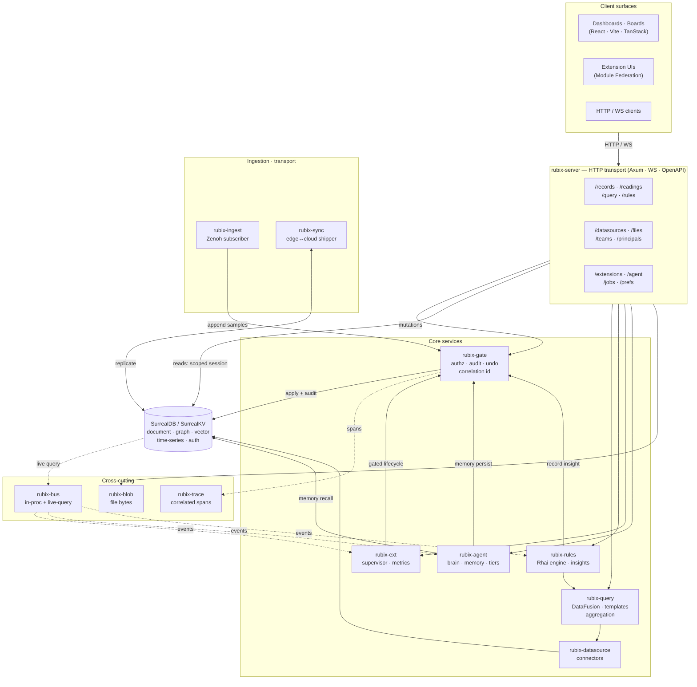

# Architecture

Rubix is one binary that runs identically at the edge and in the cloud. The
layers below all attach around SurrealDB.

## Layers

| Layer | Role |
| --- | --- |
| **Frontend** | Dashboards and extension UIs (React · Vite · TanStack · Tailwind · shadcn/ui; extension UIs via Module Federation). |
| **Realtime** | SurrealDB live queries over WebSocket push data and insights to apps. |
| **Access gate** | One authorize/scope path for every principal; captures audit, undo, and the correlation id. |
| **Audit / Undo / Tracing** | Append-only audit table, reversible change records, correlated spans on the bus. |
| **Rules / insights** | Embedded Rhai runtime — deterministic, composable, offline-capable. |
| **Query / compute** | DataFusion unifies datasources into one query surface with vectorized aggregation. |
| **Datasources** | Pluggable connectors (SurrealDB-native, Postgres, MQTT, REST, …), each a DataFusion `TableProvider`. |
| **Store / brain** | SurrealDB — document + graph + vector + time-series + geospatial; auth; SurrealQL. |
| **Ingestion / transport** | Zenoh streams data in and carries edge↔cloud transport. |
| **Internal events** | Tokio channels decouple in-process components. |

## Full-stack overview

Every box below is a crate (or a frontend surface). Mutations descend through
the access gate; reads run on a gate-issued scoped session straight against the
store. Everything attaches around SurrealDB.

> **The two-path split, visually:** the `mutations → gate → store` arrow and the
> `reads → store` arrow are the whole model. Audit, undo, correlation and tracing
> hang off the command path; reads stay unburdened.

### Crate map

| Crate | Responsibility |
| --- | --- |
| `rubix-server` | HTTP/WS transport — Axum routes, live-query bridge, OpenAPI. |
| `rubix-gate` | Authorize · audit · undo · correlation id; scoped-session issuance; capability grants + team inheritance. |
| `rubix-core` | Domain model (Principal, Record, Tag, Reading, Collection, Hook) + shared contracts. |
| `rubix-store` | SurrealDB bootstrap, scoped-session issuance, health, schema seam. |
| `rubix-bus` | Event spine — Tokio in-process channels + SurrealDB live-query pub/sub. |
| `rubix-query` | DataFusion unification, read-only SQL surface, injection-safe templates, vectorized aggregation. |
| `rubix-rules` | Embedded Rhai runtime, deterministic composable rules, insight emission. |
| `rubix-datasource` | Pluggable connectors as DataFusion `TableProvider`s; registry. |
| `rubix-ingest` | Zenoh subscriber; in-flight pre-processing (decimate · filter · enrich). |
| `rubix-sync` | Application-level edge↔cloud shipper; append-only conflict model. |
| `rubix-trace` | Correlated span emission/persistence; bounded retention; tree assembly. |
| `rubix-ext` | Extension supervisor, per-extension metrics, lifecycle bridge + reconciler. |
| `rubix-agent` | AI agent provisioning, memory recall/persist, brain wiring. |
| `rubix-blob` | Namespace-keyed file bytes; pluggable backend. |
| `rubix-prefs` | Per-user display preferences (units · datetime), applied at the DTO layer. |

## The two-path authorization model

The most load-bearing design decision: **commands and reads take different
paths.**

- A **command** (any mutation) is submitted to the access gate. The gate
  authorizes it, writes an audit entry, records an undo, and assigns a
  correlation id — then applies it.
- A **read** runs on a **scoped SurrealDB session** the gate issued at
  authentication. SurrealDB's row-level permissions enforce access directly, so
  reads and live subscriptions are not proxied message-by-message.

Conflating these two is explicitly called out as a mistake to avoid — they are
separate layers.

## Edge ↔ cloud

The same build runs on a Pi, a Windows box, or in the cloud. Differences are
configuration only: single namespace vs. namespace-per-tenant, sync on/off, and
cloud-only add-ons.
