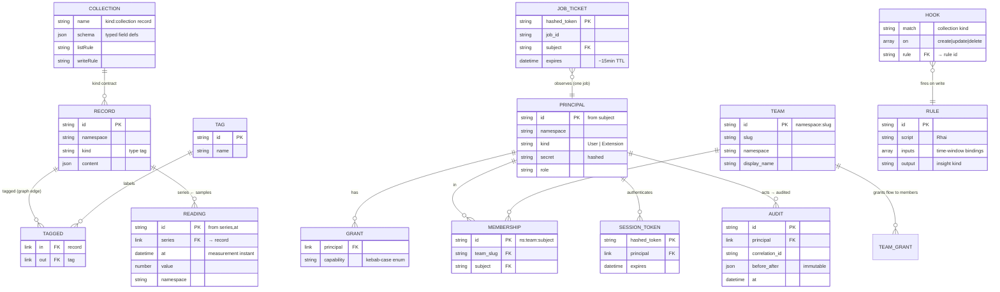

# Collections & Records

Rubix has no baked-in domain schema. Everything is a **record** on one generic store;
structure comes from a record's `kind` and its tags, not a fixed ontology. A
**collection** turns that schemaless store into a typed, validated backend at runtime —
without migrations or per-domain code.

## Collections are records

A collection is itself a `kind:"collection"` record. Defining one is a normal gated
write; its `content.schema` is the contract for every record of that kind. A built-in
meta-collection seeds idempotently on first boot.

## Typed fields & validation

Collections declare a small closed field set — `text`, `number`, `bool`, `date`,
`file`, `relation`. On write, the gate validates the record's content against its
collection's schema **before commit** (required fields, type checks). Unknown kinds
write unconstrained (the migration ramp) until a namespace flips to **strict mode**,
which makes validation fail-closed.

## Generic CRUD, filtered

- **Write** through `POST/PATCH/DELETE /records` — every mutation crosses the gate.
- **List** with `GET /records?kind=…&tag=…` — filters apply *on top of* row-level
  permissions (they narrow, never widen).
- **Realtime** with `/ws/records?kind=…` — the same row-filtered live stream, narrowed
  by kind.

## File fields

A `file` field stores a reference `{ id, filename, size, contentType }`, never raw
bytes. Bytes go through a separate blob store (`POST /files`, gated on the `FileUpload`
capability); the returned reference is stored through the normal gated record write. See
[Hooks & Files](/concepts/hooks-files).

## The stored schema

Most tables are `SCHEMALESS` by design — no domain is baked in. Collections and
hooks are themselves `record`s (distinguished by `kind`); `reading` is the only
table with typed columns. Two enforcement layers guard every row: SurrealDB
row-level permissions (namespace scoping) plus app-enforced capability grants.

> Two planes, distinct write paths: the **config/document plane** (`record`,
> `tag`, `tagged`, and the collection/hook records on top of it) and the
> high-volume append-only **readings plane**. Agents and extensions have no
> tables of their own — they are `PRINCIPAL`s of `kind:"Extension"`.

The authoritative contract lives in the internal `BACKEND-COLLECTIONS.md` design spec.
