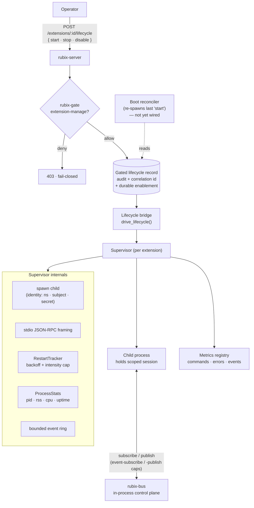
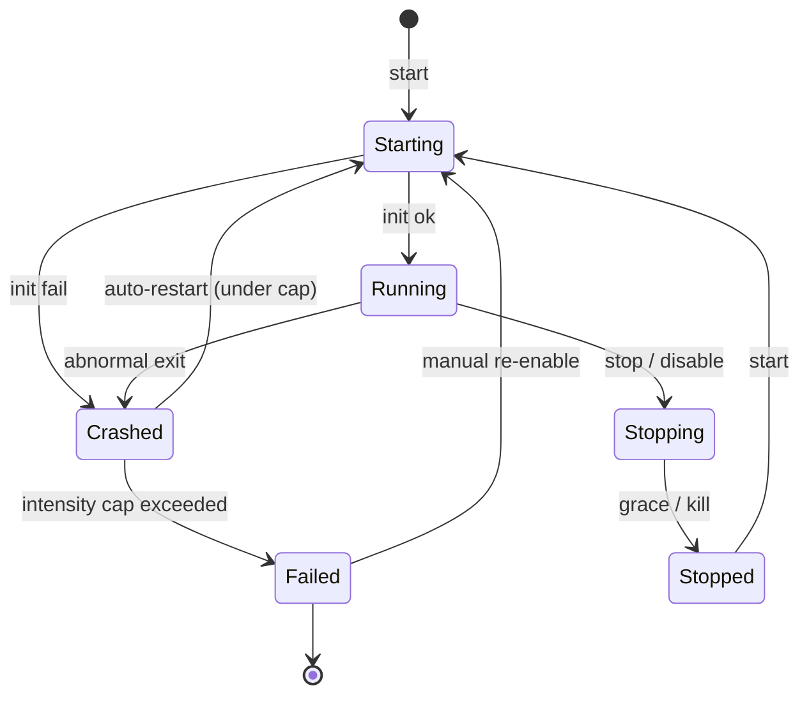

# Extensions

An extension is a **scoped principal** plus, optionally, a supervised **sidecar
process** that holds that principal's session and does work. The principal is the
security boundary; the process is the workload. An extension can reach the whole stack,
but only the data its grants allow.

## The runtime

Rubix supervises `process`-flavour extensions natively (`builtin` collapses to "no
process"; `wasm` is deferred):

- **Supervisor** — spawns and restarts a child binary under the extension's identity,
  samples process stats (pid, rss, cpu, uptime), frames stdio JSON-RPC, restarts on
  crash with backoff, and keeps a bounded event ring. Shutdown is cooperative over the
  control channel, not POSIX signals.
- **Lifecycle bridge** — a `start`/`stop`/`disable` command crosses the gate (gated on
  the `extension-manage` capability, fail-closed, audited with a correlation id), then
  drives the supervisor. The gated lifecycle record is **both** the audit trail and the
  durable enablement state — there is no separate enablement store.
- **Metrics** — atomic per-extension counters (commands, errors, events) folded with
  live process gauges.
- **Health** — a real liveness probe: process-flavour consults the supervisor; builtin
  falls back to a session ping.

The gated lifecycle record is the single source of truth; the supervisor map is a
derived, rebuildable in-memory cache that subscribes to it.

### Lifecycle states

## Admin surface

Seven routes under `/extensions` list extensions, show a full record, live process
stats, merged metrics, the event ring, drive lifecycle, and probe health. Reads are
scoped to the caller's namespace; the lifecycle mutation is the only gated write.

A boot-time reconciler that re-spawns extensions last left in `start` exists in the
runtime but is **not yet wired into server startup** — so the handler-drives path works,
but reboot durability is pending. The full design and status live in the internal
`EXTENSION-RUNTIME.md` spec.
