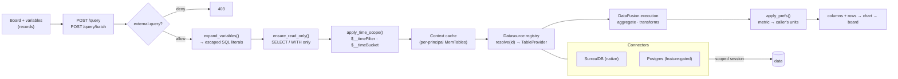

# Query & Dashboards

A **query → chart → board** pipeline turns data into dashboards. Queries run across
registered datasources through one unified surface; charts and boards are records, so
they are versioned, audited, and shareable like anything else.

## The pipeline

A query is lowered and guarded before it ever touches DataFusion: variables
become escaped literals, the statement is checked read-only, time macros are
resolved server-side, then the resolved datasource is mounted as a
`TableProvider` and executed against a per-principal context cache.

> The same `{ sql, time, variables, transforms }` contract flows through both
> `/query` and `/query/batch`, and the rules engine reuses the **same rollup +
> context cache** — so a rule binding and a dashboard panel see identical buckets.

## Query surface

`POST /query` runs a query on the caller's scoped session; `POST /query/batch` runs many
at once (one round-trip for a whole board). Results are **raw canonical values** —
metric units, UTC timestamps. A per-principal context cache scans canonical tables once
and reuses them across statements, keyed by scope identity so one principal's rows never
leak to another.

## Variables & templating

Dashboard variables (`$site`, `${site:csv}`, `$__sqlIn(site)`) are lowered into
**escaped SQL literals server-side, before the read-only guard** — so a variable value
can never break out of quoting or smuggle a second statement. Variables live in the
board record and travel with it on export/import.

## Time handling

Time is structured on the wire — absolute epoch-ms or relative tokens (`now-1h`,
`now/d`) plus a grain. The **backend owns** window resolution and interval snapping via
`$__timeFilter`, `$__timeBucket`, and `$__interval` macros. A board never splices a
locale datetime into SQL.

## Units, preferences & rendering

Declared quantity columns are converted server-side from metric to the principal's unit
system, post-cache and per-caller. Users set unit system, datetime pattern, and IANA
timezone via `GET`/`PATCH /prefs`; the client formatter turns a UTC instant + timezone +
pattern into a label. Charts carry a Grafana-style FieldConfig (thresholds, value
mappings, unit overrides). Transforms run hybrid: aggregate ops server-side in
DataFusion, cosmetic ops client-side.

## Boards & navigation

A board is a grid of panels, each pointing at a chart. Boards can be parameterized and
mounted into a **navigation tree** (`kind:"nav_node"` records) with per-mount context
overrides — so one templated board serves many sites without re-authoring. Refresh
polling snaps cache keys to the poll tick; a data-change event invalidates affected
entries so boards don't stay stale until TTL.

The full design lives in the internal `DASHBOARDS-SCOPE.md`, `VARIABLES-AND-TEMPLATING.md`,
and `PAGE-CONTEXT-AND-NAV.md` specs.
