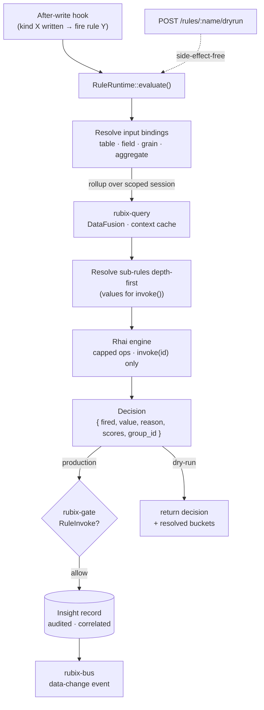

# Rules & Insights

The rule/insight runtime is **embedded and offline-capable** — rules fire on the edge
with no cloud dependency, emitting insights deterministically through the gate.

## A rule

A rule is a record (`kind:"rule"`) carrying a **Rhai script** plus the inputs and
sub-rules it may read. Inputs are **time-window bindings**: each names a table, a numeric
field, a grain (minute/hour/day/week), an aggregate (avg/min/max/…), and an optional
filter. A binding resolves to the most recent rollup bucket over the scoped session.

## The sandbox

The Rhai engine is hardened for determinism — capped operations and call depth, and a
single host function `invoke(id)` that returns a pre-computed sub-rule's value (no I/O
inside the script). A script returns a `Decision`: `{ fired, value, reason, scores?,
group_id? }`. Missing required fields are an error, never a silent default.

## Composition

A rule declares its sub-rules up front; the evaluator resolves them depth-first **before**
the script runs, so `invoke("child-rule")` returns that child's decision value.
Composition stays deterministic and I/O-free.

## Firing & recording

Rules fire on the after-write **hook** path (see [Hooks & Files](/concepts/hooks-files))
or via dry-run. A production firing records its decision as an **insight** through the
gate — audited, correlated, carrying `fired/value/reason/scores/group_id`. The capability
split is deliberate: `RuleDefine` gates authoring a rule, `RuleInvoke` gates recording a
firing.

> Authoring crosses the gate under `RuleDefine`; recording a firing crosses it
> under `RuleInvoke` — two separate grants. Dry-run runs the *exact* same script
> against real history but never records or emits.

## Rules Studio

The `/rules` API is a full authoring surface: CRUD, a **side-effect-free `dryrun`**
against real history, a `catalog` endpoint to discover bindable fields and filters, and
a `referencing` endpoint to see a rule's blast radius before editing or deleting it.

A rule firing is also a comparable, chartable **evaluation datapoint** (its `scores` and
`group_id`) — the same shape that will cover agent-run QA. The full design lives in the
internal `RULES-ENGINE.md` spec.
